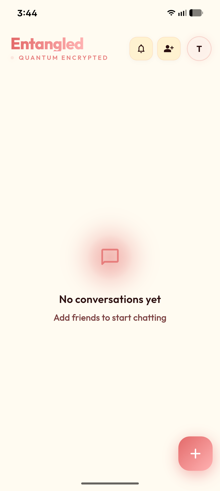
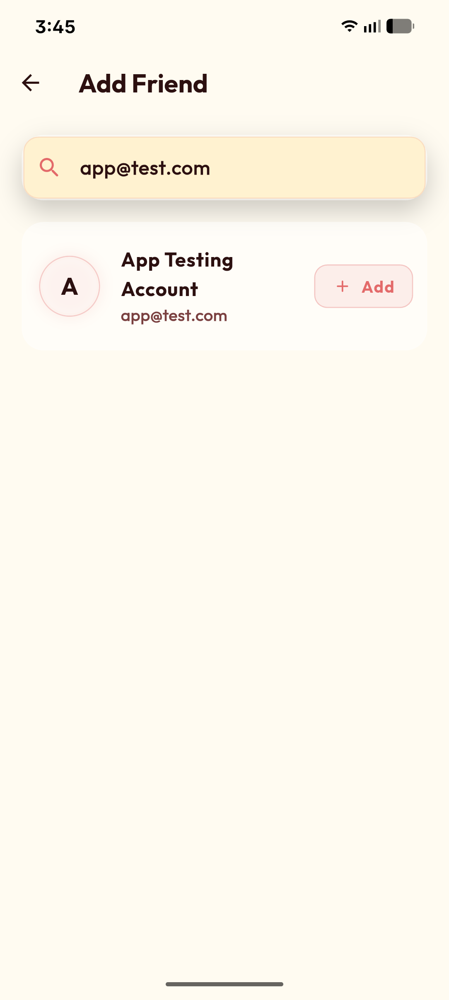
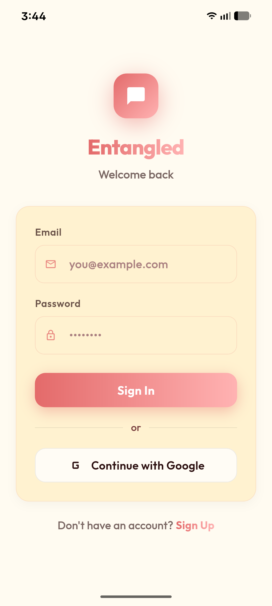

# 🪢 Entangled

[](https://flutter.dev)
[](LICENSE)
[](https://github.com/AkiTheMemeGod/Entangled/releases)
[](https://github.com/AkiTheMemeGod/Entangled)
[](https://entangled.app)

> **Privacy-first messaging for Android. Free, open-source, and ad-free.**

A modern Flutter messaging application that puts your privacy first. Real-time chat, voice notes, and beautiful themes — with zero tracking, zero ads, and zero compromises.

🌐 **[Visit Showcase Website →](https://entangled.app)**



## 📱 Download

**[⬇️ Download Latest APK](https://github.com/AkiTheMemeGod/Entangled/releases/latest)** | 
**[🌐 View Website](https://entangled.app)** |
**[⭐ Star on GitHub](https://github.com/AkiTheMemeGod/Entangled)**

---

## ✨ Project Overview

**Entangled** is a modern, feature-rich messaging platform built with Flutter. It demonstrates production-grade architecture, scalable backend infrastructure, and a delightful user experience. Whether you're chatting one-on-one or managing friend networks, Entangled keeps you connected in real-time.

---

## 📸 Screenshots

<div align="center">
  <table>
    <tr>
      <td align="center">
        
        <br/><sub>Home Screen</sub>
      </td>
      <td align="center">
        
        <br/><sub>Real-time Chat</sub>
      </td>
      <td align="center">
        
        <br/><sub>Friend Requests</sub>
      </td>
    </tr>
    <tr>
      <td align="center">
        
        <br/><sub>Theme Customization</sub>
      </td>
      <td align="center">
        
        <br/><sub>Profile Page</sub>
      </td>
      <td align="center">
        
        <br/><sub>Secure Login</sub>
      </td>
    </tr>
  </table>
</div>

---

## 🚀 Quick Start

### Prerequisites
- Flutter SDK (3.x or higher)
- Android Studio / Xcode
- Supabase account (for backend)

### Installation

```bash
# Clone the repository
git clone https://github.com/AkiTheMemeGod/Entangled.git
cd Entangled

# Install dependencies
flutter pub get

# Run the app
flutter run
```

### Build Release APK
```bash
flutter build apk --release
```

---

## 🎯 Why Entangled?

### 🎯 Core Vision

Create an elegant, responsive messaging application that prioritizes:
- **Instant Communication** - Real-time message delivery and notifications
- **Privacy & Security** - Secure authentication and encrypted connections
- **Cross-Platform Excellence** - Native performance on mobile, web, and desktop
- **Developer Experience** - Clean architecture and maintainable codebase

---

## 🚀 Key Features

### 💬 **Real-Time Messaging**
- Instant message delivery using Supabase real-time subscriptions
- Live chat interface with typing indicators
- Message persistence and message history
- Seamless sync across multiple devices

### 🤝 **Friend Management**
- Add and manage friends with intuitive UI
- Friend requests with accept/decline functionality
- Organized contact list for easy navigation
- Real-time friend status updates

### 🔔 **Intelligent Notifications**
- Push notifications powered by Supabase Edge Functions
- Smart notification triggers for incoming messages
- Background handling for all platforms
- In-app notification flyouts with actionable notifications

### 🎵 **Audio Capabilities**
- Voice message recording and playback
- High-quality audio processing
- Optimized audio caching for performance
- Seamless integration with messaging flow

### 🌈 **Customizable Themes**
- Multiple theme variants (Light/Dark mode)
- Persistent theme preferences
- Beautiful Material Design implementation
- Smooth theme transitions

### 🔐 **Secure Authentication**
- Google Sign-In integration
- Supabase Auth with email verification
- Secure token management
- Multi-platform credential handling

### 📱 **Multi-Platform Support**
- **Android** - Full native support with Material Design
- **iOS** - Optimized for Apple ecosystem
- **Web** - Responsive web experience
- **Windows** - Desktop application with MSIX installer
- **macOS & Linux** - Full support via Flutter

---

## 🏗️ Architecture & Technology Stack

### Frontend Framework
- **Flutter** - Cross-platform UI framework
- **Riverpod** - Reactive dependency injection and state management
- **Material Design** - Modern, accessible UI components

### Backend & Services
- **Supabase** - Open-source Firebase alternative
  - PostgreSQL database for data persistence
  - Real-time subscriptions for live updates
  - Edge Functions for serverless backend logic
  - Authentication & user management
- **Google Sign-In** - OAuth 2.0 authentication

### Key Dependencies
- **flutter_riverpod** - State management and provider pattern
- **supabase_flutter** - Supabase SDK integration
- **google_sign_in** - OAuth authentication
- **cached_network_image** - Image caching and optimization
- **audioplayers** - Audio playback and recording
- **flutter_animate** - Smooth animations and transitions
- **google_fonts** - Beautiful typography
- **image_picker** - Media selection
- **shared_preferences** - Local storage

---

## 💡 Design Patterns & Best Practices

### Clean Architecture
```
lib/
├── config/          # App configuration & routes
├── models/          # Data models and entities
├── providers/       # Riverpod providers (state & dependencies)
├── screens/         # Full-page UI components
├── services/        # Business logic & API integration
├── theme/           # Design system & theming
└── widgets/         # Reusable UI components
```

### State Management Philosophy
- **Riverpod Providers** - All state flows through typed providers
- **Reactive Updates** - UI automatically responds to state changes
- **Dependency Injection** - Services injected through providers
- **Separation of Concerns** - UI, business logic, and data are cleanly separated

### Data Flow
1. **Services** fetch and manage data (Supabase, auth, etc.)
2. **Providers** expose services and computed state
3. **Screens/Widgets** consume providers via `ConsumerWidget`
4. **Real-time Updates** stream through subscriptions

---

## 🔄 Real-Time Architecture

### Message Flow
```
User Types Message
    ↓
Service sends to Supabase
    ↓
Supabase stores in DB & broadcasts
    ↓
Real-time subscription triggers
    ↓
Riverpod provider updates state
    ↓
UI rebuilds with new message
```

### Notification Pipeline
```
Message inserted in DB
    ↓
Database trigger fires
    ↓
Supabase Edge Function executes
    ↓
Push notification service sends
    ↓
App receives & displays notification
```

---

## 🎨 User Experience Features

### Responsive Design
- Adaptive layouts for all screen sizes
- Optimized for mobile, tablet, and desktop
- Touch-friendly interaction targets
- Proper keyboard handling

### Performance Optimizations
- Image caching with `flutter_cache_manager`
- Lazy loading for message lists
- Efficient database queries
- Shimmer loading states for better perceived performance

### Visual Polish
- Smooth animations with `flutter_animate`
- Material Design transitions
- Contextual UI states (loading, error, empty)
- Accessible color contrasts and typography

---

## 🔐 Security & Privacy

### Authentication
- OAuth 2.0 with Google Sign-In
- Supabase Auth with secure token handling
- Email verification for account security
- Secure session management

### Data Protection
- End-to-end data transmission via HTTPS
- PostgreSQL database encryption at rest
- Row-level security policies in Supabase
- Secure API key management via environment variables

### User Privacy
- Minimal data collection
- GDPR-compliant architecture
- Friend request approval workflow
- User-controlled message history

---

## 📦 Distribution & Deployment

### Platform-Specific Builds
- **Android APK/AAB** - Play Store ready
- **iOS IPA** - App Store optimized
- **Web** - Progressive Web App capabilities
- **Windows MSIX** - Desktop installer for Windows
- **macOS** - Native app bundle
- **Linux** - Desktop application

### Backend Deployment
- Supabase Cloud or self-hosted
- Edge Functions for serverless operations
- PostgreSQL database with automatic backups
- Real-time WebSocket infrastructure

---

## 🌟 Highlights

✅ **Production-Ready** - Industry-standard patterns and practices
✅ **Fully Typed** - Dart type safety throughout
✅ **Testable Architecture** - Dependency injection enables easy testing
✅ **Scalable** - Riverpod state management scales with app complexity
✅ **Maintainable** - Clean separation of concerns and consistent patterns
✅ **Performance** - Optimized rendering and smart caching
✅ **Accessible** - Material Design accessibility guidelines followed
✅ **Open Foundation** - Built on open-source technologies

---

## 🛠️ Development Considerations

### Code Organization
- **Screens** - Page-level UI components
- **Widgets** - Reusable UI components
- **Services** - Business logic and external integrations
- **Models** - Data structures and entities
- **Providers** - State management and dependency injection
- **Config** - Centralized configuration and routing

### State Flow
- Push state down (parents don't know about children)
- Props and callbacks for communication
- Providers as the single source of truth
- Immutable data structures for predictability

### Key Concepts
- **Providers** expose data and services
- **ConsumerWidget** reads providers
- **Real-time Subscriptions** keep UI in sync
- **Services** handle external communication

---

## 🎓 Learning Resources

This project is an excellent reference for:
- Flutter best practices and architecture
- Riverpod state management patterns
- Supabase integration in Flutter
- Real-time application design
- Cross-platform Flutter development
- Production-grade app structure

---

## 📝 Database Schema

### Core Tables
- **users** - User profiles and authentication
- **chats** - Conversation metadata
- **messages** - Chat messages with timestamps
- **friend_requests** - Friend connection management
- **notifications** - Push notification logs

---

## 🎯 Project Goals

This application demonstrates:
1. **Modern Flutter Development** - Current best practices and patterns
2. **Scalable Architecture** - Grows with app complexity
3. **Real-Time Communication** - Live updates without polling
4. **Multi-Platform Delivery** - One codebase, multiple platforms
5. **User-Centric Design** - Delightful, responsive interface
6. **Production Quality** - Ready for real-world deployment

---

<div align="center">

### Built with ❤️ using Flutter & Supabase

*Entangled: Where conversations flow seamlessly.*

</div>

---
